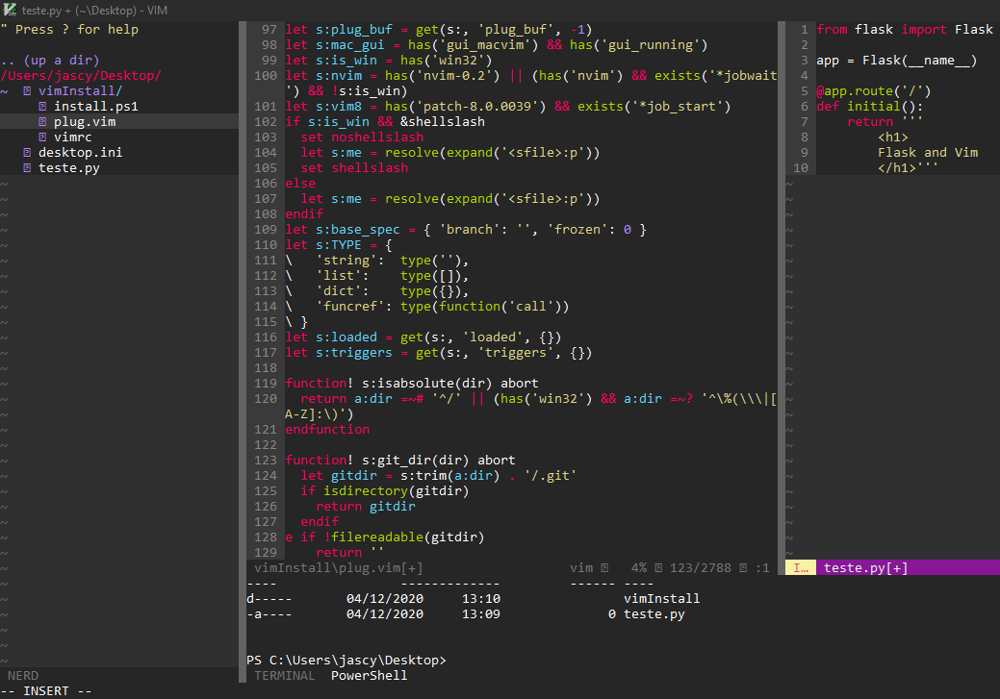

# instalador facil e com personalização do vim para windows


*passo a passo para a instalação*

1. abra o PowerShell como adminstrador
2. navegue ate a pasta do projeto via PowerShell
    ~~~
    cd ./vimInstall
    ~~~
3. rode o comando: 
    ~~~
    Set-ExecutionPolicy Bypass -Scope Process
    ~~~
4. Agora rode o script:
    ~~~~
    ./install.ps1
    ~~~~
5. Rode:
    ~~~~
    vim "C:\Users\$env:USERNAME\vimfiles\autoload\plug.vim"
    ~~~~
6. Dentro de seu Vim rode:
    ~~~~
    :runtime %
    ~~~~
7. Aida dentro de seu Vim rode:
    ~~~~
    :PlugInstall
    ~~~~

ótimo se tudo ocorreu bem basta reiniciar seu vim

__Obs:__ para usar seu vim em fullscreen inicialize-o pelo terminal

````
cmd vim 
````
> depois de abrir pressione F11
ou
````
powershell vim
````
> depois de abrir pressione F11